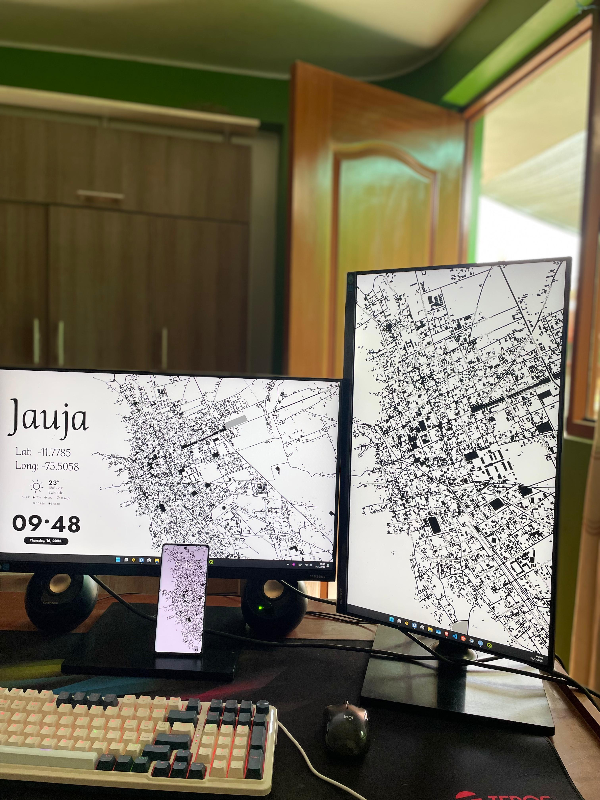

En este 📂repositorio encontrarás una serie de pasos 📜 que te llevará a lograr una personalización exclusiva para tu propio entorno de trabajo 🖥️, en especial para los usuarios de Windows, y todo esto con un estilo geográfico único de cualquier parte del mundo🌎, claro todo esto usando software libre de código abierto. 

Adapta tu entorno de trabajo según tu ubicación 📍,y lleva tu pasión por la geografía a otro nivel. 

## Panel fotográfico 
Si quieres que tu personalización aparezca en este panel, usa los hashtags #geografope y #geoaesthict. ¡Seguro que estará aquí!
Si no, envíame un pequeño pull request.

## ⚫ Pasos a realizar 
1. Primer paso: Instalación de `Rainmeter` y `QGIS`.
2. Segundo paso: Configuración de `Rainmeter`.
3. Tercer paso: Generar un wallpaper con  `QGIS`.
4. Cuarto paso: Visualizar el resultado de nuestro entorno.

Todo el proceso desarrollado esta explicado al detalle en el siguiente video de YouTube 🎥.

¡Enteráte más y aprender conmigo! 🔍💡 Suscríbete, activa las notificaciones 🔔 y únete a la comunidad que ama el software libre de código abierto. 🌟🌍 👇
- https://www.youtube.com/@geografope

- https://www.tiktok.com/@geografope

- https://www.linkedin.com/in/antonybarja/

## ⚫ Referencias:
 - https://www.rainmeter.net/
 - https://qgis.org/
 - https://www.deviantart.com/xenium-art/art/Tiny-Weather-Animated-UPDATED-25-JAN-2023-939250053
 - https://www.deviantart.com/starlender/art/Pill-Widgets-for-Rainmeter-923205530